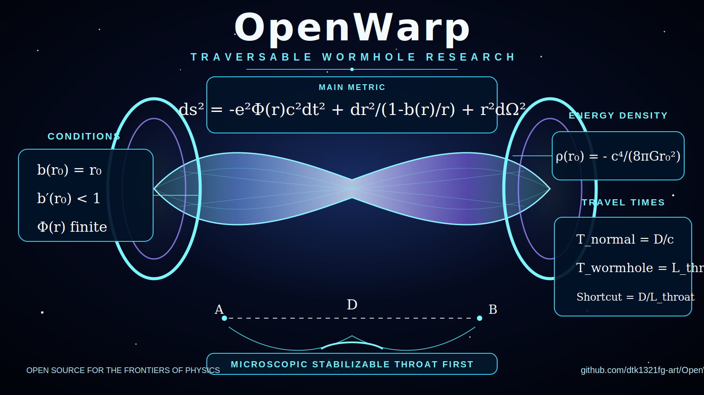

# OpenWarp Visual Assets



## Hero Image

File:

```txt
assets/openwarp-wormhole-formulas.svg
```

Use in the main README with:

```md

```

This image visualizes the traversable wormhole research track with the Morris-Thorne metric, throat conditions, negative energy density relation, and shortcut travel-time equations.
